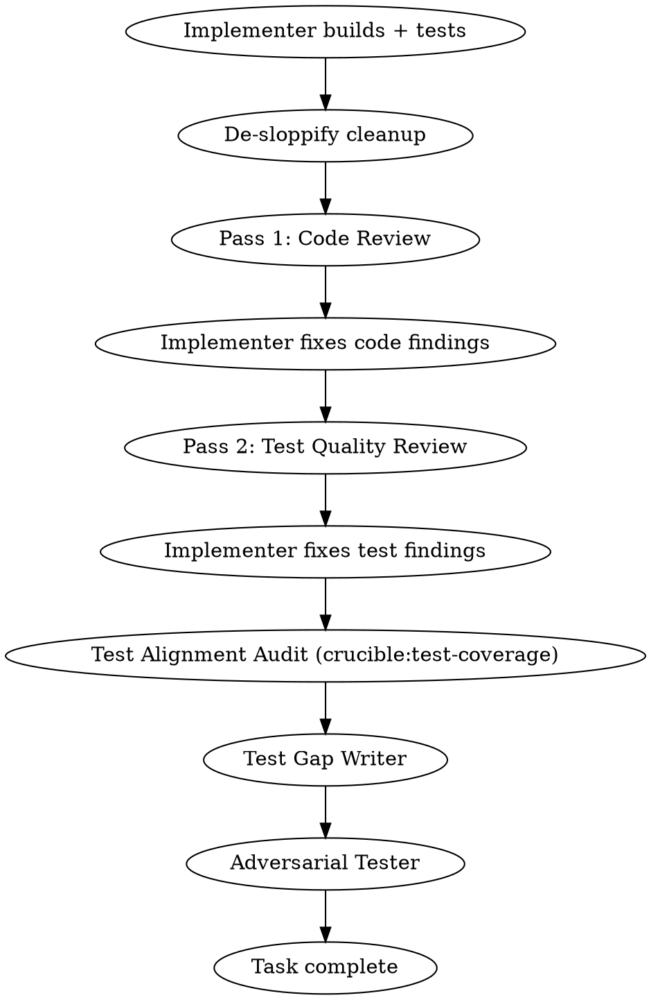

# Build

## Overview

End-to-end development pipeline: interactive design, autonomous planning with adversarial review, team-based execution with per-task code and test review. One command, idea to completion.

**Announce at start:** "I'm using the build skill to run the full development pipeline."

**Guiding principle:** Quality over velocity. This pipeline produces correct, well-integrated, maintainable output — even if slower. Parallel execution is available for independent work, but sequential with quality gates is the default.

## Communication Requirement (Non-Negotiable)

**Between every agent dispatch and every agent completion, output a status update to the user.** This is NOT optional — the user cannot see agent activity without your narration.

Every status update must include:
1. **Current phase** — Which pipeline phase you're in
2. **What just completed** — What the last agent reported
3. **What's being dispatched next** — What you're about to do and why
4. **Task checklist** — Current status of all tasks (pending/in-progress/complete)

**After compaction:** If you just experienced context compaction, re-read the task list from disk and output current status before continuing. Do NOT proceed silently.

**Examples of GOOD narration:**
> "Phase 3, Task 4 complete. Reviewer found 2 Important issues — dispatching implementer to fix. Tasks: [1] ✓ [2] ✓ [3] ✓ [4] fixing [5-8] pending"

> "Phase 2 complete. Plan passed review with 0 issues on round 2. Dispatching innovate on the plan."

**This requirement exists because:** Long-running autonomous pipelines can run for hours. Without narration, the user sees nothing but a spinner. They can't assess progress, can't decide whether to intervene, and can't learn from the pipeline's decisions.

## Mode Detection

Before dispatching the design skill, determine whether this build is:

- **Feature mode** (default) — adding new capability. Success = new acceptance tests pass.
- **Refactor mode** — restructuring existing code. Success = existing behavior preserved + structural goals met.

**Detection:** If the user's intent is ambiguous, ask directly before proceeding:

> "Is this adding new behavior, or restructuring existing code without changing what it does?"

The user's answer sets the mode for the entire pipeline. No special syntax needed.

### Mode Propagation

Propagate refactor mode to subagents through:

1. **New refactor-specific prompt templates** — `contract-test-writer-prompt.md` and `refactor-implementer-addendum.md` are standalone files used only in refactor mode. Select these instead of (or in addition to) the feature-mode equivalents.
2. **Appended context blocks** — For existing prompts that serve both modes (`plan-writer-prompt.md`, `build-implementer-prompt.md`), append a "Refactor Mode Context" section when pasting the prompt. The templates remain flat markdown — the orchestrator decides what to paste.
3. **Scratch file for compaction recovery** — Persist the current mode in `/tmp/crucible-build-mode.md` containing `mode: refactor` or `mode: feature` plus the baseline commit SHA. Only one build runs per session, so a well-known filename is sufficient.

### Compaction Recovery

Build's existing compaction step must read the mode file FIRST, before re-reading the task list or any other state. On resumption after compaction:

1. **Read `/tmp/crucible-build-mode.md`** — first file read after compaction, before anything else.
2. **If file is missing:** Default to feature mode and warn: "Mode file not found — defaulting to feature mode. If this was a refactoring session, please restart."
3. **If mode is `refactor`:** Read the baseline commit SHA from the mode file and verify the commit exists (`git cat-file -t <SHA>`). If the SHA is missing or invalid, warn and halt — proceeding with refactor mode without a valid rollback target is unsafe.
4. **After mode is recovered:** Proceed with normal compaction recovery flow.

## Phase 1: Design (Interactive)

- **Model:** Opus (creative/architectural work needs the best model)
- **Mode:** Interactive with the user
- **RECOMMENDED SUB-SKILL:** Use crucible:forge (feed-forward mode) — consult past lessons before starting
- **RECOMMENDED SUB-SKILL:** Use crucible:cartographer (consult mode) — review codebase map for structural awareness
- **REQUIRED SUB-SKILL:** Use crucible:design
- Follow design skill for design refinement, section-by-section validation, and saving the design doc
- **OVERRIDE:** When design completes and the design doc is saved, do NOT follow design's "Implementation" section (do not chain into planning or worktree from there). Return control to this build skill — Phase 2 handles planning with its own subagent-based approach.
- Phase ends when user approves the design (says "go", "looks good", "proceed", etc.)
- **Everything after this point is autonomous** — tell the user: "Design approved. Starting autonomous pipeline — I'll only interrupt for escalations."

### Step 2: Innovate and Red-Team the Design

After the user approves the design and before starting Phase 2:

1. **Innovate:** Dispatch `crucible:innovate` on the design doc. Plan Writer incorporates the proposal.
2. **Quality gate:** Dispatch `crucible:quality-gate` on the (potentially updated) design doc with artifact type "design". Iterates until clean or stagnation.
3. If the quality gate requires changes, the Plan Writer updates the design doc and re-commits.
4. Design doc is now finalized — proceed to acceptance tests.

### Step 3: Generate Acceptance Tests (RED)

Before planning, define "done" with executable tests:

1. Dispatch an **Acceptance Test Writer** subagent (Opus) using `./acceptance-test-writer-prompt.md`
   - Input: finalized design doc (especially acceptance criteria)
   - Output: integration-level test file(s) that verify feature behavior end-to-end
2. Run the acceptance tests — verify they **FAIL** (the feature doesn't exist yet)
   - If tests pass: something is wrong — investigate before proceeding
   - If tests error (won't compile): this is expected in typed languages — note which tests exist and what they verify. They become the first implementation task.
3. Commit: `test: add acceptance tests for [feature] (RED)`

These tests define the feature-level RED-GREEN cycle that wraps the entire pipeline. The pipeline is done when these tests pass.

### Refactor Mode: Phase 1 Changes

When in refactor mode, Phase 1 shifts from "what should we build?" to "what are we changing and what could break?"

#### Blast Radius Analysis

After the user describes the refactoring intent, the design phase:

1. **Identify the target** — What code is being restructured? (module, interface, data representation, file organization, etc.)
2. **Trace the blast radius** using cartographer (if available) or fallback exploration:
   - **Direct consumers** — code that imports/calls/references the target
   - **Indirect dependents** — code that depends on consumers (transitive)
   - **Test coverage** — which tests exercise the target behavior
   - **Configuration/wiring** — DI registrations, config files, build scripts that reference the target
   - **Fallback when cartographer is unavailable:** Use language-aware symbol search via agent exploration. Grep for symbol references (imports, type annotations, function calls) using language-specific patterns. The impact manifest's confidence field reflects reduced precision.
3. **Present an impact manifest** to the user:

```
### Impact Manifest

**Target:** [what's being restructured]
**Structural goal:** [what the code should look like after]

**Direct consumers:** N files
- path/to/consumer1.py (calls TargetClass.method)
- path/to/consumer2.py (imports TargetClass)

**Indirect dependents:** N files
- path/to/dependent.py (depends on consumer1)

**Test coverage:**
- N tests directly exercise target behavior
- N tests exercise consumers
- Gap: no tests cover [specific seam]

**Risk assessment:** [Low/Medium/High] based on consumer count and coverage gaps
**Confidence:** [High/Medium/Low] — High if cartographer used, Medium/Low if fallback
```

**When confidence is Low**, require explicit user confirmation before proceeding. The user must review the impact manifest and confirm the blast radius is complete.

4. **Design the structural goal** — what should the code look like after the refactoring? User validates the target state.

#### Acceptance Tests (Refactor Mode)

Instead of writing NEW acceptance tests (Step 3 above), the pipeline:

1. **Dispatch the contract test writer** using `./contract-test-writer-prompt.md` — a single agent handles gap identification AND gap filling. Input: impact manifest + blast radius file list. The agent maps existing tests to behavioral seams, identifies untested seams, and writes contract tests for each gap.
2. **Run all contract tests GREEN** — contract tests must pass before any refactoring begins.
3. **If a contract test FAILS:** The contract test writer investigates:
   - **Test defect** (wrong assertion, bad setup) — fix the test and re-run
   - **Latent codebase bug** — report to user with options: (a) fix the bug first, (b) exclude this seam and accept the risk, (c) abort the refactoring. Never silently drop a failing contract test.
4. **Commit:** `test: add contract tests for [target] refactoring (GREEN — locking existing behavior)`

#### Proportionality Escape Valve

Contract test writing must remain proportional to the refactoring scope. Trigger a scope check when **any** of these thresholds are hit:

- **Count threshold:** More than 15 contract tests needed
- **Effort threshold:** Contract test writer reports context pressure, or estimated total contract test LOC exceeds ~2x the estimated refactoring scope LOC

When triggered:
1. Present the full gap list to the user with estimated effort per gap
2. User selects which gaps to fill and which to accept as uncovered risk
3. Proceed with only user-selected contract tests

The impact manifest records which gaps the user chose to leave uncovered.

## Phase 2: Plan (Autonomous)

### Step 1: Write the Plan

Dispatch a **Plan Writer** subagent (Opus):

- Read the design doc produced in Phase 1 and the acceptance tests from Step 3
- Write an implementation plan following the `crucible:planning` format
- If acceptance tests couldn't compile (typed language), Task 1 should create the interfaces/stubs needed for them to compile and fail correctly
- Include per-task metadata: Files (with count), Complexity (Low/Medium/High), Dependencies
- Save to `docs/plans/YYYY-MM-DD-<topic>-implementation-plan.md`
- Plan tasks should be scoped to 2-3 per subagent, ~10 files max (context budget awareness)

Use `./plan-writer-prompt.md` template for the dispatch prompt.

### Step 2: Review the Plan

Dispatch a **Plan Reviewer** subagent:

Reviewer model selection:
- Plan touches **4+ systems** or has **10+ tasks** → Opus
- Plan touches **1-3 systems** with **<10 tasks** → Sonnet
- When in doubt → Opus

Review protocol (iterative):
- Dispatch Plan Reviewer to check plan against design doc
- If issues found: record issue count, dispatch Plan Writer to revise
- Dispatch NEW fresh Plan Reviewer on revised plan (no anchoring)
- Compare issue count to prior round:
  - Strictly fewer issues → progress, loop again
  - Same or more issues → stagnation, **escalate to user** with findings from both rounds
- Loop until plan passes with no issues
- **Architectural concerns bypass the loop** — immediate escalation regardless of round

Use `./plan-reviewer-prompt.md` template for the dispatch prompt.

### Step 3: Innovate and Red-Team the Plan

**After the plan passes review:**

1. **Innovate:** Dispatch `crucible:innovate` on the approved plan. Plan Writer incorporates the proposal into the plan.
2. **Quality gate:** Dispatch `crucible:quality-gate` on the (potentially updated) plan with artifact type "plan". Provides the plan and design doc as context.

The quality gate handles the iterative red-team loop — fresh review each round, weighted stagnation detection, 15-round safety limit, escalation. See `crucible:quality-gate` for details.

## Phase 3: Execute (Autonomous, Team-Based)

### Step 0: Load Module Context for Subagents

- **RECOMMENDED SUB-SKILL:** Use crucible:cartographer (load mode) — when dispatching implementers and reviewers, paste relevant module files, conventions.md, and landmines.md into their prompts

### Step 1: Create Team and Task List

Create a team using `TeamCreate`:
```
team_name: "build-<feature-name>"
description: "Building <feature description>"
```

Read the approved plan. Create tasks via `TaskCreate` for each plan task, including:
- Subject from plan task title
- Description with full plan task text (subagents should never read the plan file)
- Dependencies via `TaskUpdate` with `addBlockedBy`

#### Agent Teams Fallback

If `TeamCreate` fails (agent teams not available), output a clear one-time warning:

> ⚠️ Agent teams are not available. Recommended: set `CLAUDE_CODE_EXPERIMENTAL_AGENT_TEAMS=1`
> Falling back to sequential subagent dispatch via Agent tool.

Then fall back to sequential subagent dispatch via the regular Task tool (without `team_name`). Everything still works — independent tasks run sequentially instead of in parallel via teammates.

**What changes in fallback mode:**
- Tasks are dispatched via `Agent` tool instead of as teammates
- Independent tasks that would run in parallel now run sequentially
- Task tracking still uses `TaskCreate`/`TaskUpdate` for state management
- All other pipeline behavior (TDD, review, de-sloppify, quality gates) is unchanged

### Step 2: Analyze Dependencies and Execution Order

Before dispatching:
1. Map the dependency graph from plan task metadata
2. Identify independent tasks (no shared files, no sequential dependencies)
3. Group into execution waves — independent tasks parallel, dependent tasks sequential
4. Assess complexity per task for reviewer model selection

### Step 3: Execute Tasks

For each task (or wave of parallel tasks):

1. Mark task `in_progress` via `TaskUpdate`
2. Spawn **Implementer** teammate (Opus) via Task tool with `team_name` and `subagent_type="general-purpose"`
   - Use `./build-implementer-prompt.md` template
   - Pass full task text, file paths, project conventions
   - Implementer follows TDD, writes tests, runs tests, commits, self-reviews
3. When Implementer reports completion, run **De-Sloppify Cleanup** (see below)
4. After cleanup completes, spawn **Reviewer** teammate
   - Use `./build-reviewer-prompt.md` template

#### De-Sloppify Cleanup

After the implementer reports completion and before dispatching the reviewer:

1. Record the pre-cleanup commit SHA
2. Dispatch a fresh **Cleanup Agent** (Opus) using `./cleanup-prompt.md`
   - Input: `git diff <pre-task-sha>..HEAD` (the implementer's committed changes)
   - The orchestrator provides the pre-task commit SHA to the cleanup agent
3. Cleanup agent reviews changes, removes unnecessary code (see allowlist), runs tests
4. If cleanup made changes, commits separately: `refactor: cleanup task N implementation`
5. If cleanup found nothing to remove, reports "No cleanup needed" and proceeds

#### Reviewer Model Selection (Lead Decides Per-Task)

| Task Complexity | Reviewer Model |
|----------------|----------------|
| Low (1-3 files, straightforward) | Sonnet |
| Medium (3-6 files, some cross-system) | Lead decides (default Opus) |
| High (6+ files, refactoring, deep chains) | Opus |
| When in doubt | Opus |

#### Two-Pass Review Cycle

Each task gets TWO review passes before completion:



**Pass 1 — Code Review:** Architecture, patterns, correctness, wiring (actually connected, not just existing?)

**Pass 2 — Test Quality Review:** Test independence? Determinism? Edge cases? Integration tests where mocks are masking real behavior? AAA pattern? Correct test level? (Staleness and alignment checks are handled by the test-coverage dispatch below.)

#### Test Alignment Audit

After the implementer addresses Pass 2 findings, invoke `crucible:test-coverage` against the task's changes:
- Code diff: `git diff <pre-task-sha>..HEAD`
- Affected test files: test files touched or related to the task
- Context: "Build task N: [task description]"

The test-coverage skill audits existing tests for staleness (wrong assertions, misleading descriptions, dead tests, coincidence tests) and handles its own fix dispatch and revert-on-failure logic. It returns a structured report. Note: the diff includes review fix commits — the audit agent should focus on behavioral changes to source files, not changes that only touch test files.

**Skip this step if** the task made no behavioral source changes (only `.md`, `.json`, config files).

#### Test Gap Writer

After test-coverage completes (or is skipped), dispatch a **Test Gap Writer** (Opus) using `./test-gap-writer-prompt.md`:

1. Input: Pass 2 test reviewer's missing coverage findings + implementer's changes + test-coverage audit report (if available)
2. The test gap writer writes tests ONLY for gaps the reviewer identified — no scope creep. Before writing a new test for a flagged gap, verify no existing test already covers this path (it may have been updated by the test-coverage audit).
3. Tests should pass immediately (the behavior already exists from implementation)
4. The test gap writer reports per-test PASS/FAIL results (see prompt template for report format)
5. Commits new tests: `test: fill coverage gaps for task N`

**If all tests PASS:** Continue to adversarial tester.

**If some tests FAIL** (gaps reveal genuinely missing implementation):
1. Dispatch a fresh implementer (Opus) with the failing test(s), their failure messages, and the gap descriptions from the reviewer
2. Implementer fixes the missing behavior, then re-runs ALL test gap writer tests (not just the failures — catches regressions from the fix)
3. If all tests pass after fix: commit (`fix: address test gap failures for task N`), continue to adversarial tester
4. If tests still fail after one fix attempt: **escalate to user** with:
   - Which coverage gaps the reviewer identified
   - Which tests the gap writer wrote (per-test PASS/FAIL)
   - What the implementer attempted to fix
   - Which tests still fail and their current failure messages

**Skip this step if** the Pass 2 test reviewer reported zero missing coverage gaps.

#### Adversarial Tester

After the test gap writer completes (or is skipped), dispatch an **Adversarial Tester** (Opus) using `skills/adversarial-tester/break-it-prompt.md`:

1. Input: Full diff of the task's changes (`git diff <pre-task-sha>..HEAD`), project test conventions, cartographer module context (if available)
2. The adversarial tester identifies the top 5 most likely failure modes, writes one test per mode, and runs them
3. Outcome handling:
   - **All tests PASS:** Implementation is robust. Log results and proceed to task complete.
   - **Some tests FAIL:** Real weaknesses found. Dispatch implementer to fix. Re-run all tests (including adversarial). If pass → task complete. If fail → one more fix attempt, then escalate to user.
   - **Tests ERROR (won't compile):** Adversarial tester mistake. Discard broken tests, log, proceed to task complete.
4. Quality bypass prevention: If the implementer's fix touches more than 3 files, route through a lightweight code review before completing.
5. Commit adversarial tests: `test: adversarial tests for task N`

**Skip this step when:**
- The task diff contains no behavioral source files (only `.md`, `.json`, `.yaml`, `.uss`, `.uxml`)
- No tests were written during implementation (pure scaffolding)

#### Iterative Review Loop

Each review pass (code and test) uses the iterative loop:
- After fixes, dispatch a **NEW fresh Reviewer** (no anchoring to prior findings)
- Track issue count between rounds
- **Strictly fewer issues** → progress, loop again
- **Same or more issues** → stagnation, **escalate to user**
- Loop until clean
- Architectural concerns → **immediate escalation** regardless of round

#### Verification Gates

After each wave completes:
1. Run full test suite (not just current wave's tests)
2. Check compilation
3. Failures → identify which task caused regression before fixing
4. Clean → proceed to next wave

#### Refactor Mode: Phase 3 Changes

When in refactor mode, Phase 3 execution differs from feature mode in several ways.

##### Pre-Execution Coverage Check

Before the first task executes:
1. Run all contract tests from Phase 1 — confirm GREEN
2. Run the full test suite — confirm GREEN (pre-execution baseline)
3. Record the "baseline commit" SHA in `/tmp/crucible-build-mode.md` — this is the rollback target

##### Tiered Test Strategy

Running the full test suite after every atomic step is prohibitively expensive. Instead:

- **(a) After each atomic task:** Run blast-radius tests + direct consumer tests only (tests identified in the impact manifest)
- **(b) After each execution wave:** Run the full test suite (matches existing verification gate between waves)
- **(c) Full suite checkpoints:** Pre-execution baseline and Phase 4 final verification always run the full suite

##### Coordinated-Atomic Execution

When the executor encounters a task marked `atomic: true`:

1. Record pre-task commit SHA
2. Implementer makes ALL changes (multiple files) — dispatch with `./refactor-implementer-addendum.md` appended
3. Run blast-radius tests + direct consumer tests (per tiered strategy)
4. **If GREEN:** Commit all files together in a single commit
5. **If FAIL:** Revert ALL files to pre-task SHA. Dispatch one retry with a fresh implementer that receives the failure context and test output. If second attempt also fails, revert to pre-task SHA and escalate to user (see Rollback Policy below).

**Key difference from feature mode:** Feature mode does RED-GREEN-REFACTOR. Refactor mode for atomic steps does **GREEN-GREEN** — tests are green before, tests must be green after. No RED phase because no new behavior is being added.

After a successful atomic commit (step 4), the rest of the per-task pipeline continues as normal: de-sloppify cleanup, two-pass review cycle, test alignment audit, test gap writer, and adversarial tester (unless skipped per restructuring-only annotation below).

**Non-atomic refactoring tasks** follow normal execution — structural changes that don't break intermediate states (e.g., extracting a private method, adding a module nothing imports yet). These use standard TDD if they introduce new abstractions, or GREEN-GREEN if they are pure restructuring.

##### Phase 3 Adaptations for Existing Steps

- **Adversarial tester:** The planner annotates each task with `restructuring-only: true/false`. If `restructuring-only: true`, adversarial testing is skipped. Tasks with `restructuring-only: false` still get adversarial testing. When in doubt, default to `false`.
  - `restructuring-only: true` examples: renames where all call sites are mechanically updated, file moves with updated paths, extract-method where the extracted method is private and preserves the original call signature
  - `restructuring-only: false` examples: extract-class where callers must change call targets, splitting a module where consumers must update imports, any change where the consumer-facing API surface shifts
- **De-sloppify cleanup:** Gains a new removal category: **dead compatibility shims.** After a refactoring task, look for leftover adapter code, re-export aliases, or compatibility layers introduced during migration but no longer referenced. Detection scope: code added after the baseline commit SHA that re-exports, aliases, or wraps symbols under old names, AND where no code outside the refactoring's changed files references the old names. **String-based references:** When the target was registered by name in a configuration system, flag the shim as UNCERTAIN and defer to the reviewer rather than removing it.

##### Refactoring Rollback Policy

###### Baseline Commit
The orchestrator records the baseline commit SHA before the first refactoring task executes (during pre-execution coverage check). Persisted in `/tmp/crucible-build-mode.md`.

###### Per-Task Rollback
When a single task fails after the executor's retry attempt:
1. Revert that task's changes to the pre-task commit SHA
2. Escalate to user with failure context and test output
3. User chooses: **skip this task and continue** (orchestrator also skips all tasks that depend on the skipped task, and informs the user which tasks were transitively skipped), **retry with guidance**, or **revert all tasks to baseline**

###### Full Rollback to Baseline
When the user chooses full rollback (or cascading failures make forward progress impossible):
1. Perform `git reset --hard <baseline-SHA>` to restore pre-refactoring state
2. Re-run all contract tests to confirm known-good state
3. Report what was reverted and why

###### Safe Partial States
The planner annotates tasks with `safe-partial: true/false`. A task is `safe-partial: true` if the codebase is in a valid, shippable state after that task completes (all tests green, no dangling references). When a later task fails, the orchestrator can offer to keep changes through the last safe-partial task.

#### Architectural Checkpoint

For plans with 10+ tasks, at ~50% completion or after a major subsystem:
- Dispatch architecture reviewer using `./architecture-reviewer-prompt.md`
- Design drift → escalate to user
- Minor concerns → adjust prompts for remaining tasks
- All clear → continue

## Phase 4: Completion

After all tasks complete:

1. **Feature mode:** Run acceptance tests from Phase 1 Step 3 — verify they **PASS** (GREEN). **Refactor mode:** Run all contract tests from Phase 1 — verify they **PASS** (GREEN).
   - If any fail: implementation is incomplete. Identify what's missing, dispatch implementer to fix, re-run.
   - If all pass: feature is verifiably done. Proceed.
2. Run full test suite (unit + integration)
3. **REQUIRED SUB-SKILL:** Use crucible:code-review on full implementation (iterative until clean)
4. **REQUIRED SUB-SKILL:** Use crucible:inquisitor on full implementation (dispatches 5 parallel dimensions against full feature diff)
   - Input: `git diff <base-sha>..HEAD` where base-sha is the commit before Phase 3 execution began
   - Runs after code review (obvious issues already fixed) and before quality gate (gate reviews final state)
   - The inquisitor manages its own fix cycle internally — do not intervene unless it escalates
   - See `crucible:inquisitor` for full process
5. **Conditional:** If the inquisitor's fix cycle produced any code changes, re-run crucible:code-review scoped to the inquisitor fix commits only (`git diff <pre-inquisitor-sha>..HEAD`)
   - This is NOT a full implementation re-review — scope it to only the fixer's changes
   - Iterative until clean, same as step 3
   - Skip if the inquisitor reported all PASS (no fixes were needed)
6. **REQUIRED SUB-SKILL:** Use crucible:quality-gate on full implementation (artifact type: "code", iterative until clean)
7. **RECOMMENDED SUB-SKILL:** Use crucible:forge (retrospective mode) — capture what happened vs what was planned
8. **RECOMMENDED SUB-SKILL:** Use crucible:cartographer (record mode) — persist any new codebase knowledge discovered during build
9. Compile summary: what was built, acceptance tests passing, review findings addressed, inquisitor findings, concerns
10. Report to user
11. **REQUIRED SUB-SKILL:** Use crucible:finish — **skip finish's Step 2.5 (test-coverage)** since test-coverage ran per-task in Phase 3, and **skip finish's Step 3 (red-team)** since quality-gate already ran at step 6. Tell finish to skip both.

### Session Metrics

Throughout the pipeline, the orchestrator appends timestamped entries to `/tmp/crucible-metrics-<session-id>.log` on each subagent dispatch and completion.

At completion (before reporting to user, i.e. step 9), read the metrics log and compute:

```
-- Pipeline Complete ----------------------------------------
  Subagents dispatched:  23 (14 Opus, 7 Sonnet, 2 Haiku)
  Active work time:      2h 47m
  Wall clock time:       11h 13m
  Quality gate rounds:   4 (design: 2, plan: 1, impl: 1)
-------------------------------------------------------------
```

**Metrics tracked:**
- Total subagents dispatched (by type and model tier: Opus/Sonnet/Haiku)
- Active work time (merge overlapping parallel intervals — NOT naive sum)
- Wall clock time (first dispatch to final completion)
- Quality gate rounds (per gate: design, plan, implementation)

### Pipeline Decision Journal

Alongside the metrics log, maintain a decision journal at `/tmp/crucible-decisions-<session-id>.log`. Append a structured entry for every non-trivial routing decision:

```
[timestamp] DECISION: <type> | choice=<what> | reason=<why> | alternatives=<rejected>
```

Decision types to capture:
- `reviewer-model` — why Opus vs Sonnet for this reviewer
- `gate-round` — issue count, severity shifts, progress/stagnation per round
- `escalation` — why the orchestrator escalated to user (and user's decision)
- `task-grouping` — parallelism decisions for wave execution
- `cleanup-removal` — what de-sloppify removed and accept/reject decision

## Escalation Triggers (Any Phase)

**STOP and ask the user when:**
- Architectural concerns in plan or code review
- Review loop stagnation (same or more issues after fixes — any phase)
- Test suite failures not obviously fixable
- Multiple teammates fail on different tasks
- Teammate reports context pressure at 50%+ with significant work remaining

**Minor issues:** Log, work around, include in final report.

## What the Lead Should NOT Do

- Implement code (dispatch implementers)
- Read large files (spawn Haiku researcher)
- Debug failing tests (dispatch implementer)
- Make architectural decisions (escalate to user)

## Context Management

- **One task per agent** — always spawn a fresh implementer for each task. Never send a second task to a running agent via SendMessage. Reusing agents accumulates context and causes exhaustion.
- "2-3 per subagent, ~10 files max" refers to **plan design** — group small steps into one task at planning time, not sequential dispatch to a running agent
- Lead stays thin — coordination only
- All important state on disk (plan files, task list)
- Teammates report at 50%+ context usage
- Lead compaction acceptable — task list is source of truth
- **Agent teams unavailable:** If agent teams are not enabled, the lead dispatches tasks sequentially via Agent tool. Task tracking still uses TaskCreate/TaskUpdate. The pipeline is slower but functionally identical.

## Prompt Templates

- `./acceptance-test-writer-prompt.md` — Phase 1 acceptance test generation
- `./plan-writer-prompt.md` — Phase 2 plan writer dispatch
- `./plan-reviewer-prompt.md` — Phase 2 plan reviewer dispatch
- `./build-implementer-prompt.md` — Phase 3 implementer dispatch
- `./build-reviewer-prompt.md` — Phase 3 reviewer dispatch
- `./cleanup-prompt.md` — Phase 3 de-sloppify cleanup dispatch
- `./test-gap-writer-prompt.md` — Phase 3 test gap writer dispatch
- `./architecture-reviewer-prompt.md` — Mid-plan checkpoint
- `./contract-test-writer-prompt.md` — Phase 1 refactor-mode contract test generation
- `./refactor-implementer-addendum.md` — Phase 3 refactor-mode implementer addendum (appended to build-implementer-prompt)

Red-team, innovate, adversarial tester, and inquisitor prompts live in their respective skills:
- `crucible:red-team` — `skills/red-team/red-team-prompt.md`
- `crucible:innovate` — `skills/innovate/innovate-prompt.md`
- `crucible:adversarial-tester` — `skills/adversarial-tester/break-it-prompt.md`
- `crucible:inquisitor` — `skills/inquisitor/inquisitor-prompt.md`

## Quality Gate Orchestration

Build is the outermost orchestrator and controls all quality gates via `crucible:quality-gate`. Quality gate wraps `crucible:red-team` internally — do NOT invoke red-team separately at these points.

**Gate points in the pipeline:**

| Pipeline Stage | Artifact Type | Replaces |
|---------------|---------------|----------|
| Phase 1, Step 2 (after design) | design | Existing `crucible:red-team` on design |
| Phase 2, Step 3 (after plan review) | plan | Existing `crucible:red-team` on plan |
| Phase 4, Step 6 (after inquisitor + conditional re-review) | code | Existing `crucible:red-team` on implementation |

Code review (`crucible:code-review`) and inquisitor (`crucible:inquisitor`) remain separate from the quality gate — code-review does structured quality checks, inquisitor writes cross-component adversarial tests, and the quality gate does adversarial artifact review. All three serve distinct purposes.

## Integration

**Required sub-skills:**
- **crucible:design** — Phase 1
- **crucible:finish** — Phase 4
- **crucible:quality-gate** — Iterative red-teaming at each quality gate point
- **crucible:red-team** — Adversarial review engine (invoked by quality-gate)
- **crucible:innovate** — Creative enhancement before quality gates
- **crucible:inquisitor** — Full-feature cross-component adversarial testing (Phase 4, after code-review, before quality-gate)

**Recommended sub-skills:**
- **crucible:forge** — Feed-forward at Phase 1 start, retrospective at Phase 4 completion
- **crucible:cartographer** — Consult at Phase 1 start, load at Phase 3 dispatches, record at Phase 4

**Phase 3 sub-skills (dispatched per-task):**
- **crucible:test-coverage** — Test alignment audit after each task's test quality review (staleness, dead tests, coincidence tests)

**Implementer sub-skills:**
- **crucible:test-driven-development** — TDD within each task
