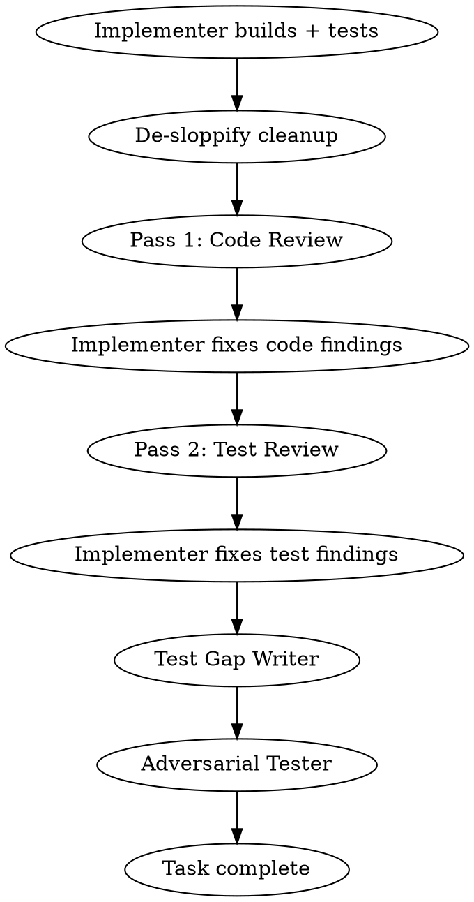

# Build

## Overview

End-to-end development pipeline: interactive design, autonomous planning with adversarial review, team-based execution with per-task code and test review. One command, idea to completion.

**Announce at start:** "I'm using the build skill to run the full development pipeline."

**Guiding principle:** Quality over velocity. This pipeline produces correct, well-integrated, maintainable output — even if slower. Parallel execution is available for independent work, but sequential with quality gates is the default.

## Communication Requirement (Non-Negotiable)

**Between every agent dispatch and every agent completion, output a status update to the user.** This is NOT optional — the user cannot see agent activity without your narration.

Every status update must include:
1. **Current phase** — Which pipeline phase you're in
2. **What just completed** — What the last agent reported
3. **What's being dispatched next** — What you're about to do and why
4. **Task checklist** — Current status of all tasks (pending/in-progress/complete)

**After compaction:** If you just experienced context compaction, re-read the task list from disk and output current status before continuing. Do NOT proceed silently.

**Examples of GOOD narration:**
> "Phase 3, Task 4 complete. Reviewer found 2 Important issues — dispatching implementer to fix. Tasks: [1] ✓ [2] ✓ [3] ✓ [4] fixing [5-8] pending"

> "Phase 2 complete. Plan passed review with 0 issues on round 2. Dispatching innovate on the plan."

**This requirement exists because:** Long-running autonomous pipelines can run for hours. Without narration, the user sees nothing but a spinner. They can't assess progress, can't decide whether to intervene, and can't learn from the pipeline's decisions.

## Phase 1: Design (Interactive)

- **Model:** Opus (creative/architectural work needs the best model)
- **Mode:** Interactive with the user
- **RECOMMENDED SUB-SKILL:** Use crucible:forge (feed-forward mode) — consult past lessons before starting
- **RECOMMENDED SUB-SKILL:** Use crucible:cartographer (consult mode) — review codebase map for structural awareness
- **REQUIRED SUB-SKILL:** Use crucible:design
- Follow design skill for design refinement, section-by-section validation, and saving the design doc
- **OVERRIDE:** When design completes and the design doc is saved, do NOT follow design's "Implementation" section (do not chain into planning or worktree from there). Return control to this build skill — Phase 2 handles planning with its own subagent-based approach.
- Phase ends when user approves the design (says "go", "looks good", "proceed", etc.)
- **Everything after this point is autonomous** — tell the user: "Design approved. Starting autonomous pipeline — I'll only interrupt for escalations."

### Step 2: Innovate and Red-Team the Design

After the user approves the design and before starting Phase 2:

1. **Innovate:** Dispatch `crucible:innovate` on the design doc. Plan Writer incorporates the proposal.
2. **Quality gate:** Dispatch `crucible:quality-gate` on the (potentially updated) design doc with artifact type "design". Iterates until clean, stagnation, or 3-round cap.
3. If the quality gate requires changes, the Plan Writer updates the design doc and re-commits.
4. Design doc is now finalized — proceed to acceptance tests.

### Step 3: Generate Acceptance Tests (RED)

Before planning, define "done" with executable tests:

1. Dispatch an **Acceptance Test Writer** subagent (Opus) using `./acceptance-test-writer-prompt.md`
   - Input: finalized design doc (especially acceptance criteria)
   - Output: integration-level test file(s) that verify feature behavior end-to-end
2. Run the acceptance tests — verify they **FAIL** (the feature doesn't exist yet)
   - If tests pass: something is wrong — investigate before proceeding
   - If tests error (won't compile): this is expected in typed languages — note which tests exist and what they verify. They become the first implementation task.
3. Commit: `test: add acceptance tests for [feature] (RED)`

These tests define the feature-level RED-GREEN cycle that wraps the entire pipeline. The pipeline is done when these tests pass.

## Phase 2: Plan (Autonomous)

### Step 1: Write the Plan

Dispatch a **Plan Writer** subagent (Opus):

- Read the design doc produced in Phase 1 and the acceptance tests from Step 3
- Write an implementation plan following the `crucible:planning` format
- If acceptance tests couldn't compile (typed language), Task 1 should create the interfaces/stubs needed for them to compile and fail correctly
- Include per-task metadata: Files (with count), Complexity (Low/Medium/High), Dependencies
- Save to `docs/plans/YYYY-MM-DD-<topic>-implementation-plan.md`
- Plan tasks should be scoped to 2-3 per subagent, ~10 files max (context budget awareness)

Use `./plan-writer-prompt.md` template for the dispatch prompt.

### Step 2: Review the Plan

Dispatch a **Plan Reviewer** subagent:

Reviewer model selection:
- Plan touches **4+ systems** or has **10+ tasks** → Opus
- Plan touches **1-3 systems** with **<10 tasks** → Sonnet
- When in doubt → Opus

Review protocol (iterative):
- Dispatch Plan Reviewer to check plan against design doc
- If issues found: record issue count, dispatch Plan Writer to revise
- Dispatch NEW fresh Plan Reviewer on revised plan (no anchoring)
- Compare issue count to prior round:
  - Strictly fewer issues → progress, loop again
  - Same or more issues → stagnation, **escalate to user** with findings from both rounds
- Loop until plan passes with no issues
- **Architectural concerns bypass the loop** — immediate escalation regardless of round

Use `./plan-reviewer-prompt.md` template for the dispatch prompt.

### Step 3: Innovate and Red-Team the Plan

**After the plan passes review:**

1. **Innovate:** Dispatch `crucible:innovate` on the approved plan. Plan Writer incorporates the proposal into the plan.
2. **Quality gate:** Dispatch `crucible:quality-gate` on the (potentially updated) plan with artifact type "plan". Provides the plan and design doc as context.

The quality gate handles the iterative red-team loop — fresh review each round, stagnation detection, 3-round cap, escalation. See `crucible:quality-gate` for details.

## Phase 3: Execute (Autonomous, Team-Based)

### Step 0: Load Module Context for Subagents

- **RECOMMENDED SUB-SKILL:** Use crucible:cartographer (load mode) — when dispatching implementers and reviewers, paste relevant module files, conventions.md, and landmines.md into their prompts

### Step 1: Create Team and Task List

Create a team using `TeamCreate`:
```
team_name: "build-<feature-name>"
description: "Building <feature description>"
```

Read the approved plan. Create tasks via `TaskCreate` for each plan task, including:
- Subject from plan task title
- Description with full plan task text (subagents should never read the plan file)
- Dependencies via `TaskUpdate` with `addBlockedBy`

#### Agent Teams Fallback

If `TeamCreate` fails (agent teams not available), output a clear one-time warning:

> ⚠️ Agent teams are not available. Recommended: set `CLAUDE_CODE_EXPERIMENTAL_AGENT_TEAMS=1`
> Falling back to sequential subagent dispatch via Agent tool.

Then fall back to sequential subagent dispatch via the regular Task tool (without `team_name`). Everything still works — independent tasks run sequentially instead of in parallel via teammates.

**What changes in fallback mode:**
- Tasks are dispatched via `Agent` tool instead of as teammates
- Independent tasks that would run in parallel now run sequentially
- Task tracking still uses `TaskCreate`/`TaskUpdate` for state management
- All other pipeline behavior (TDD, review, de-sloppify, quality gates) is unchanged

### Step 2: Analyze Dependencies and Execution Order

Before dispatching:
1. Map the dependency graph from plan task metadata
2. Identify independent tasks (no shared files, no sequential dependencies)
3. Group into execution waves — independent tasks parallel, dependent tasks sequential
4. Assess complexity per task for reviewer model selection

### Step 3: Execute Tasks

For each task (or wave of parallel tasks):

1. Mark task `in_progress` via `TaskUpdate`
2. Spawn **Implementer** teammate (Opus) via Task tool with `team_name` and `subagent_type="general-purpose"`
   - Use `./build-implementer-prompt.md` template
   - Pass full task text, file paths, project conventions
   - Implementer follows TDD, writes tests, runs tests, commits, self-reviews
3. When Implementer reports completion, run **De-Sloppify Cleanup** (see below)
4. After cleanup completes, spawn **Reviewer** teammate
   - Use `./build-reviewer-prompt.md` template

#### De-Sloppify Cleanup

After the implementer reports completion and before dispatching the reviewer:

1. Record the pre-cleanup commit SHA
2. Dispatch a fresh **Cleanup Agent** (Opus) using `./cleanup-prompt.md`
   - Input: `git diff <pre-task-sha>..HEAD` (the implementer's committed changes)
   - The orchestrator provides the pre-task commit SHA to the cleanup agent
3. Cleanup agent reviews changes, removes unnecessary code (see allowlist), runs tests
4. If cleanup made changes, commits separately: `refactor: cleanup task N implementation`
5. If cleanup found nothing to remove, reports "No cleanup needed" and proceeds

#### Reviewer Model Selection (Lead Decides Per-Task)

| Task Complexity | Reviewer Model |
|----------------|----------------|
| Low (1-3 files, straightforward) | Sonnet |
| Medium (3-6 files, some cross-system) | Lead decides (default Opus) |
| High (6+ files, refactoring, deep chains) | Opus |
| When in doubt | Opus |

#### Two-Pass Review Cycle

Each task gets TWO review passes before completion:



**Pass 1 — Code Review:** Architecture, patterns, correctness, wiring (actually connected, not just existing?)

**Pass 2 — Test Review:** Stale tests? Missing coverage? Tests need updating? Dead tests to delete? Edge cases untested?

#### Test Gap Writer

After the implementer addresses Pass 2 findings, dispatch a **Test Gap Writer** (Opus) using `./test-gap-writer-prompt.md`:

1. Input: Pass 2 test reviewer's missing coverage findings + implementer's changes
2. The test gap writer writes tests ONLY for gaps the reviewer identified — no scope creep
3. Tests should pass immediately (the behavior already exists from implementation)
4. If a test fails: the gap reveals genuinely missing implementation — flag for the implementer to fix before task completion
5. Commits new tests: `test: fill coverage gaps for task N`

**Skip this step if** the Pass 2 test reviewer reported zero missing coverage gaps.

#### Adversarial Tester

After the test gap writer completes (or is skipped), dispatch an **Adversarial Tester** (Opus) using `skills/adversarial-tester/break-it-prompt.md`:

1. Input: Full diff of the task's changes (`git diff <pre-task-sha>..HEAD`), project test conventions, cartographer module context (if available)
2. The adversarial tester identifies the top 5 most likely failure modes, writes one test per mode, and runs them
3. Outcome handling:
   - **All tests PASS:** Implementation is robust. Log results and proceed to task complete.
   - **Some tests FAIL:** Real weaknesses found. Dispatch implementer to fix. Re-run all tests (including adversarial). If pass → task complete. If fail → one more fix attempt, then escalate to user.
   - **Tests ERROR (won't compile):** Adversarial tester mistake. Discard broken tests, log, proceed to task complete.
4. Quality bypass prevention: If the implementer's fix touches more than 3 files, route through a lightweight code review before completing.
5. Commit adversarial tests: `test: adversarial tests for task N`

**Skip this step when:**
- The task diff contains no behavioral source files (only `.md`, `.json`, `.yaml`, `.uss`, `.uxml`)
- No tests were written during implementation (pure scaffolding)

#### Iterative Review Loop

Each review pass (code and test) uses the iterative loop:
- After fixes, dispatch a **NEW fresh Reviewer** (no anchoring to prior findings)
- Track issue count between rounds
- **Strictly fewer issues** → progress, loop again
- **Same or more issues** → stagnation, **escalate to user**
- Loop until clean
- Architectural concerns → **immediate escalation** regardless of round

#### Verification Gates

After each wave completes:
1. Run full test suite (not just current wave's tests)
2. Check compilation
3. Failures → identify which task caused regression before fixing
4. Clean → proceed to next wave

#### Architectural Checkpoint

For plans with 10+ tasks, at ~50% completion or after a major subsystem:
- Dispatch architecture reviewer using `./architecture-reviewer-prompt.md`
- Design drift → escalate to user
- Minor concerns → adjust prompts for remaining tasks
- All clear → continue

## Phase 4: Completion

After all tasks complete:
1. Run acceptance tests from Phase 1 Step 3 — verify they **PASS** (GREEN)
   - If any fail: implementation is incomplete. Identify what's missing, dispatch implementer to fix, re-run.
   - If all pass: feature is verifiably done. Proceed.
2. Run full test suite (unit + integration)
3. **REQUIRED SUB-SKILL:** Use crucible:code-review on full implementation (iterative until clean)
4. **REQUIRED SUB-SKILL:** Use crucible:quality-gate on full implementation (artifact type: "code", iterative until clean)
5. **RECOMMENDED SUB-SKILL:** Use crucible:forge (retrospective mode) — capture what happened vs what was planned
6. **RECOMMENDED SUB-SKILL:** Use crucible:cartographer (record mode) — persist any new codebase knowledge discovered during build
7. Compile summary: what was built, acceptance tests passing, review findings addressed, concerns
8. Report to user
9. **REQUIRED SUB-SKILL:** Use crucible:finish

### Session Metrics

Throughout the pipeline, the orchestrator appends timestamped entries to `/tmp/crucible-metrics-<session-id>.log` on each subagent dispatch and completion.

At completion (before reporting to user, i.e. step 8), read the metrics log and compute:

```
-- Pipeline Complete ----------------------------------------
  Subagents dispatched:  23 (14 Opus, 7 Sonnet, 2 Haiku)
  Active work time:      2h 47m
  Wall clock time:       11h 13m
  Quality gate rounds:   4 (design: 2, plan: 1, impl: 1)
-------------------------------------------------------------
```

**Metrics tracked:**
- Total subagents dispatched (by type and model tier: Opus/Sonnet/Haiku)
- Active work time (merge overlapping parallel intervals — NOT naive sum)
- Wall clock time (first dispatch to final completion)
- Quality gate rounds (per gate: design, plan, implementation)

### Pipeline Decision Journal

Alongside the metrics log, maintain a decision journal at `/tmp/crucible-decisions-<session-id>.log`. Append a structured entry for every non-trivial routing decision:

```
[timestamp] DECISION: <type> | choice=<what> | reason=<why> | alternatives=<rejected>
```

Decision types to capture:
- `reviewer-model` — why Opus vs Sonnet for this reviewer
- `gate-round` — issue count, severity shifts, progress/stagnation per round
- `escalation` — why the orchestrator escalated to user (and user's decision)
- `task-grouping` — parallelism decisions for wave execution
- `cleanup-removal` — what de-sloppify removed and accept/reject decision

## Escalation Triggers (Any Phase)

**STOP and ask the user when:**
- Architectural concerns in plan or code review
- Review loop stagnation (same or more issues after fixes — any phase)
- Test suite failures not obviously fixable
- Multiple teammates fail on different tasks
- Teammate reports context pressure at 50%+ with significant work remaining

**Minor issues:** Log, work around, include in final report.

## What the Lead Should NOT Do

- Implement code (dispatch implementers)
- Read large files (spawn Haiku researcher)
- Debug failing tests (dispatch implementer)
- Make architectural decisions (escalate to user)

## Context Management

- **One task per agent** — always spawn a fresh implementer for each task. Never send a second task to a running agent via SendMessage. Reusing agents accumulates context and causes exhaustion.
- "2-3 per subagent, ~10 files max" refers to **plan design** — group small steps into one task at planning time, not sequential dispatch to a running agent
- Lead stays thin — coordination only
- All important state on disk (plan files, task list)
- Teammates report at 50%+ context usage
- Lead compaction acceptable — task list is source of truth
- **Agent teams unavailable:** If agent teams are not enabled, the lead dispatches tasks sequentially via Agent tool. Task tracking still uses TaskCreate/TaskUpdate. The pipeline is slower but functionally identical.

## Prompt Templates

- `./acceptance-test-writer-prompt.md` — Phase 1 acceptance test generation
- `./plan-writer-prompt.md` — Phase 2 plan writer dispatch
- `./plan-reviewer-prompt.md` — Phase 2 plan reviewer dispatch
- `./build-implementer-prompt.md` — Phase 3 implementer dispatch
- `./build-reviewer-prompt.md` — Phase 3 reviewer dispatch
- `./cleanup-prompt.md` — Phase 3 de-sloppify cleanup dispatch
- `./test-gap-writer-prompt.md` — Phase 3 test gap writer dispatch
- `./architecture-reviewer-prompt.md` — Mid-plan checkpoint

Red-team, innovate, and adversarial tester prompts live in their respective skills:
- `crucible:red-team` — `skills/red-team/red-team-prompt.md`
- `crucible:innovate` — `skills/innovate/innovate-prompt.md`
- `crucible:adversarial-tester` — `skills/adversarial-tester/break-it-prompt.md`

## Quality Gate Orchestration

Build is the outermost orchestrator and controls all quality gates via `crucible:quality-gate`. Quality gate wraps `crucible:red-team` internally — do NOT invoke red-team separately at these points.

**Gate points in the pipeline:**

| Pipeline Stage | Artifact Type | Replaces |
|---------------|---------------|----------|
| Phase 1, Step 2 (after design) | design | Existing `crucible:red-team` on design |
| Phase 2, Step 3 (after plan review) | plan | Existing `crucible:red-team` on plan |
| Phase 4, Step 4 (after implementation) | code | Existing `crucible:red-team` on implementation |

Code review (`crucible:code-review`) remains separate — it serves a different purpose (structured quality check vs. adversarial attack).

## Integration

**Required sub-skills:**
- **crucible:design** — Phase 1
- **crucible:finish** — Phase 4
- **crucible:quality-gate** — Iterative red-teaming at each quality gate point
- **crucible:red-team** — Adversarial review engine (invoked by quality-gate)
- **crucible:innovate** — Creative enhancement before quality gates

**Recommended sub-skills:**
- **crucible:forge** — Feed-forward at Phase 1 start, retrospective at Phase 4 completion
- **crucible:cartographer** — Consult at Phase 1 start, load at Phase 3 dispatches, record at Phase 4

**Implementer sub-skills:**
- **crucible:test-driven-development** — TDD within each task
