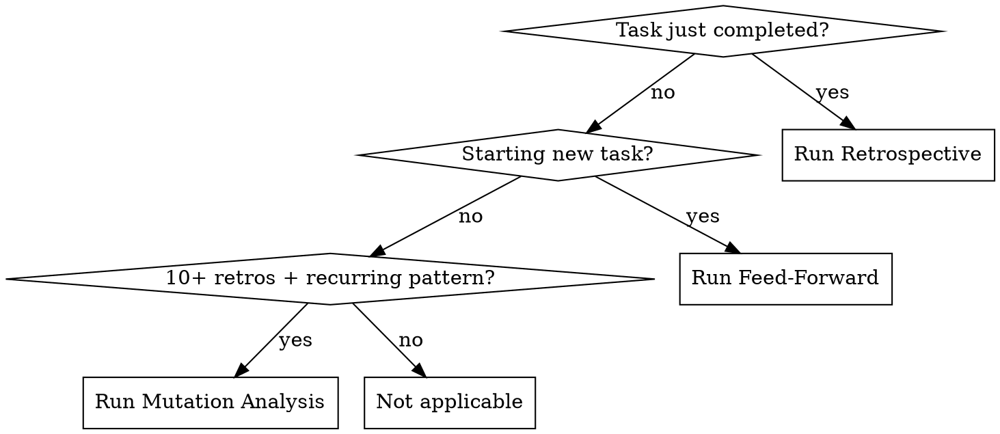

# Forge

## Overview

Self-improving retrospective system. After tasks complete, runs structured retrospectives. Before tasks begin, consults accumulated lessons. Periodically proposes concrete skill edits based on evidence.

**Core principle:** The agent that never reviews its own performance never improves. The Forge closes the loop.

**Announce at start:** "I'm using the forge skill to [run a retrospective / consult past lessons / propose skill improvements]."

## When to Use



**Three modes:**
- **Retrospective** — after any significant task (build, debug, plan execution, branch finish)
- **Feed-Forward** — before design, planning, or execution begins
- **Mutation Proposals** — when enough data accumulates (10+ retrospectives, 3+ of same deviation type)

**Significant task** = anything that used `crucible:build`, `crucible:debugging`, or `crucible:finish`. Simple questions and file reads do not qualify.

## Storage

All data lives in the project memory directory:

```
~/.claude/projects/<project-hash>/memory/forge/
  retrospectives/
    YYYY-MM-DD-HHMMSS-<slug>.md    # Individual entries (<40 lines each)
  patterns.md                       # Aggregated patterns (max 200 lines)
  mutation-proposals/
    YYYY-MM-DD-<topic>.md           # Skill mutation proposals
```

**Context budget:** `patterns.md` MUST stay under 200 lines. It is loaded into context during feed-forward. Individual retrospective files are NOT loaded during feed-forward — only during mutation analysis.

---

## Mode 1: Post-Task Retrospective

### When to Trigger

After any skill that completes a significant task reports success. The calling skill (or orchestrator) invokes `crucible:forge` in retrospective mode.

### The Process

1. Dispatch a **Retrospective Analyst** subagent (Sonnet) using `./retrospective-prompt.md`
2. Provide: task description, the plan (if any), actual execution summary, skills used, duration estimate
3. Subagent returns structured retrospective entry
4. Write entry to `~/.claude/projects/<project-hash>/memory/forge/retrospectives/YYYY-MM-DD-HHMMSS-<slug>.md`
5. Update `patterns.md` — read current file, merge new findings, rewrite
6. For debugging sessions, the retrospective also extracts diagnostic patterns using a dedicated extraction subagent (Opus). Dispatch using `./diagnostic-extraction-prompt.md`. Patterns are written to cartographer's landmines via `crucible:cartographer` (record mode) with `dead_ends` and `diagnostic_path` fields.

### Update Rules for patterns.md

1. Read the current `patterns.md` (create if first retrospective)
2. Increment counts based on new retrospective
3. Recalculate percentages and trends
4. Add new warnings only if a pattern appears **2+ times** (single occurrences stay in individual files only)
5. Prune warnings that have not occurred in the last 10 retrospectives (pattern may be resolved)
6. Keep total file **under 200 lines** — compress or remove stale entries
7. Write the updated file

### After Writing

If total retrospective count >= 10 AND any deviation type has 3+ occurrences, suggest to user:
> "Forge has accumulated enough data for skill improvement proposals. Would you like to run mutation analysis?"

---

## Mode 2: Pre-Task Feed-Forward

### When to Trigger

Before `crucible:design`, `crucible:planning`, or `crucible:build` begins its core work.

### The Process

1. Check if `~/.claude/projects/<project-hash>/memory/forge/patterns.md` exists
2. **Cold start (no file):** Report "No prior retrospective data for this project. Proceeding without feed-forward." Return immediately. No subagent needed.
3. **Data exists:** Read `patterns.md` (under 200 lines — safe for context)
4. Dispatch a **Feed-Forward Advisor** subagent (Sonnet) using `./feed-forward-prompt.md`
5. Provide: the patterns file content AND a brief description of the upcoming task
6. Subagent returns 3-5 targeted warnings/adjustments relevant to THIS task
7. Surface warnings to the calling skill's orchestrator as bias adjustments (not hard blockers)

### Cold Start Lifecycle

- **First task:** No feed-forward (no data). Retrospective runs after completion. This produces data.
- **Second task:** Feed-forward has 1 data point. Advisor notes "limited data" but still surfaces any relevant warning.
- **After 5+ tasks:** Feed-forward becomes meaningfully useful.
- **After 10+ tasks:** Mutation proposals become available.

---

## Mode 3: Skill Mutation Proposals

### When to Trigger

When `patterns.md` shows 10+ total retrospectives AND recurring patterns (3+ occurrences of same deviation type). Can also be invoked manually.

### The Process

1. Read `patterns.md` and ALL individual retrospective files in `retrospectives/`
2. Dispatch a **Mutation Analyst** subagent (Opus) using `./mutation-proposal-prompt.md`
3. Provide: the full patterns file, all retrospective entries, and a list of current skill names
4. Subagent analyzes patterns and proposes concrete skill edits
5. Write proposals to `~/.claude/projects/<project-hash>/memory/forge/mutation-proposals/YYYY-MM-DD-<topic>.md`
6. Surface proposals to the user — **NEVER auto-modify skills**

### The Iron Law of Mutations

```
NEVER AUTO-MODIFY SKILLS. PROPOSALS ONLY.
```

The Forge produces proposals for human review. It does not edit skill files. It does not dispatch subagents to edit skill files. It does not suggest "just making this small change." Every mutation requires explicit human approval.

---

## Integration

### Skills That Should Call Forge

| Calling Skill | Mode | When | What to Pass |
|---------------|------|------|--------------|
| `crucible:build` | Feed-Forward | Phase 1 start | Feature description |
| `crucible:build` | Retrospective | Phase 4, after red-team, before finishing | Full build summary |
| `crucible:debugging` | Retrospective | After fix verified | Bug description + hypothesis log |
| `crucible:debugging` | Retrospective (diagnostic extraction) | After fix verified | Session artifacts → cartographer landmines with `dead_ends` + `diagnostic_path` |
| `crucible:finish` | Retrospective | After Step 3, before Step 4 | Branch summary + review findings |
| `crucible:design` | Feed-Forward | Before first question | Topic description |

**Forge is RECOMMENDED, not REQUIRED.** It is a learning accelerator, not a quality gate. Skipping it does not produce broken output — it misses an opportunity to learn.

## Quick Reference

| Mode | Trigger | Model | Template | Output |
|------|---------|-------|----------|--------|
| Retrospective | Task completes | Sonnet | `retrospective-prompt.md` | Entry file + patterns.md update |
| Feed-Forward | Task begins | Sonnet | `feed-forward-prompt.md` | 3-5 targeted warnings |
| Mutation | 10+ retros + manual | Opus | `mutation-proposal-prompt.md` | Proposal doc for human review |

## Red Flags

**Never:**
- Skip retrospective because "task was simple"
- Let `patterns.md` exceed 200 lines
- Auto-modify any skill file
- Load individual retrospective files into feed-forward (context bloat)
- Run mutation analysis with fewer than 10 retrospectives
- Treat feed-forward warnings as hard blockers (they are advisories)

**Always:**
- Run retrospective after significant tasks
- Check for patterns.md before design/planning
- Write mutation proposals to disk for human review
- Handle cold start gracefully (no data = no feed-forward, just say so)

## Rationalization Prevention

| Excuse | Reality |
|--------|---------|
| "Task was too simple for a retrospective" | Simple tasks reveal patterns too. 2 minutes max. |
| "No time for retrospective" | Retrospective prevents the NEXT task from repeating the mistake. |
| "Feed-forward data is stale" | Prune mechanism handles staleness. Read it anyway. |
| "Mutation proposal is obviously correct, just apply it" | Iron Law: proposals only. Humans decide. |
| "Only one data point, feed-forward is useless" | Even one warning is better than none. Report limited data. |
| "I'll run the retrospective later" | Later never comes. Run it now, while context is fresh. |
| "I already know what went wrong" | Knowing is not recording. Write it down so FUTURE sessions know too. |

## Common Mistakes

**Bloating patterns.md**
- Problem: patterns.md grows past 200 lines, consuming context budget
- Fix: Prune patterns not seen in last 10 retros. Compress entries. Merge similar warnings.

**Skipping feed-forward on cold start**
- Problem: Announcing "no data" without checking the file path
- Fix: Always check the file path. If missing, say so and proceed. If exists with 1 entry, use it.

**Treating warnings as requirements**
- Problem: Feed-forward says "watch for over-engineering" and agent refuses to build anything
- Fix: Warnings are bias adjustments, not hard constraints. Note them and proceed.

**Running mutation analysis too early**
- Problem: 3 retrospectives, agent proposes sweeping skill changes
- Fix: Minimum 10 retrospectives. Below that, patterns are noise.

## Prompt Templates

- `./retrospective-prompt.md` — Post-task retrospective analyst dispatch
- `./feed-forward-prompt.md` — Pre-task feed-forward advisor dispatch
- `./mutation-proposal-prompt.md` — Skill mutation analyst dispatch
- `./diagnostic-extraction-prompt.md` — Debugging session diagnostic pattern extraction dispatch
