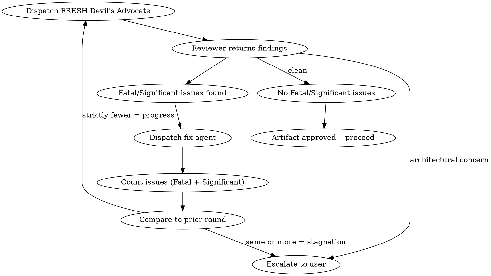

# Red Team

## Overview

Adversarial review of any artifact. Dispatches a Devil's Advocate subagent to attack the work, fixes findings, then dispatches a FRESH Devil's Advocate to attack again. Iterates until clean or stagnation is detected.

**Core principle:** Fresh eyes every round. No anchoring, no confirmation bias.

**Announce at start:** "I'm using the red-team skill to adversarially review this artifact."

## When to Use

- After a design doc is finalized (before planning)
- After an implementation plan passes review (before execution)
- After implementation is complete (before finishing)
- Anytime you want adversarial review of any artifact
- When the build pipeline calls for red-teaming

## The Iterative Loop

### Rules

1. **Fresh reviewer every round** — dispatch a NEW subagent each time. Never pass prior findings to the next reviewer. Each reviewer sees the artifact cold.
2. **Stagnation = escalation** — if Round N+1 finds >= the number of Fatal+Significant issues as Round N, stop and escalate to user with full findings from both rounds.
3. **Architectural concerns bypass the loop** — immediate escalation regardless of round or progress.
4. **No round cap** — loop as long as each round makes progress.
5. **Only Fatal and Significant count** — Minor observations are logged but don't count toward stagnation and don't trigger fix rounds.

### Issue Classification

The Devil's Advocate MUST classify every challenge:
- **Fatal:** Artifact will fail or produce broken output. Must be addressed.
- **Significant:** Artifact will work but has a meaningful risk or missed opportunity. Should be addressed.
- **Minor:** Nitpick or preference. Log it but don't block.

## How to Use

### 1. Determine artifact type and fix mechanism

| Artifact | Fix Mechanism |
|---|---|
| Design doc | Plan Writer subagent revises the doc |
| Implementation plan | Plan Writer subagent revises the plan |
| Code / implementation | Fix subagent (new, not the original implementer) |
| Documentation | Fix subagent or orchestrator if trivial |
| Standalone invocation | Caller decides |

### 2. Dispatch Devil's Advocate

Use the `red-team-prompt.md` template in this directory. Provide:
- The full artifact content (paste it, don't make the subagent read files)
- Project context (existing systems, constraints, tech stack)
- What the artifact is supposed to accomplish

Model: **Opus** (adversarial analysis needs the best model)

### 3. Process findings

- **No Fatal/Significant issues:** Artifact is approved. Proceed.
- **Fatal/Significant issues found:** Record the issue count. Dispatch fix mechanism. Then go to step 4.
- **Architectural concerns:** Escalate to user immediately. Do not attempt to fix.

### 4. Re-review after fixes

Dispatch a NEW Devil's Advocate subagent (fresh, no prior context). Compare issue count:
- **Strictly fewer Fatal+Significant issues:** Progress. Loop back to step 3.
- **Same or more Fatal+Significant issues:** Stagnation. Escalate to user with findings from both rounds.

## What the Devil's Advocate is NOT

- A code reviewer (don't check style, naming, or quality — that's `crucible:code-review`)
- A blocker for the sake of blocking — challenges must be specific and actionable
- A rewriter — they challenge, they don't produce an alternative

## Red Flags

**Never:**
- Reuse the same reviewer subagent across rounds
- Pass prior findings to the next reviewer
- Skip re-review after fixes ("the fixes look fine, let's move on")
- Ignore Fatal issues
- Proceed with unfixed Significant issues

## Integration

**Called by:**
- **crucible:quality-gate** — at each gate point (design, plan, implementation). Build invokes quality-gate, which invokes red-team.
- **crucible:finish** — before presenting options (directly, not via quality-gate)

**Pairs with:**
- **crucible:innovate** — innovate runs before red-team at each gate

See prompt template: `red-team/red-team-prompt.md`
